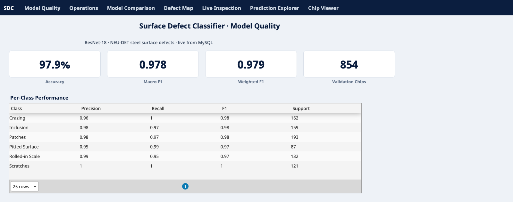
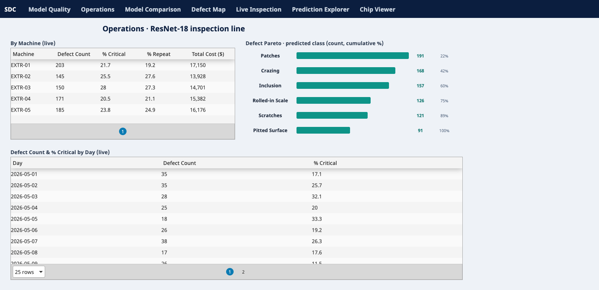
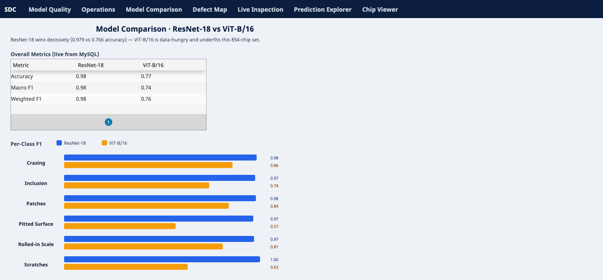
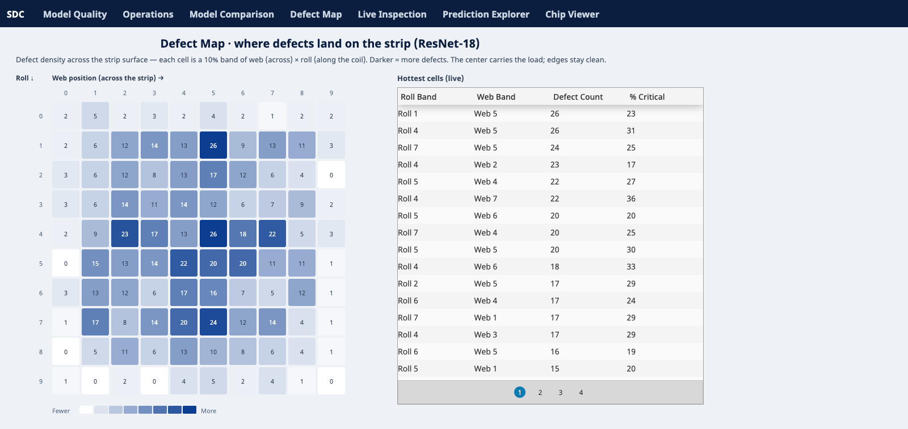
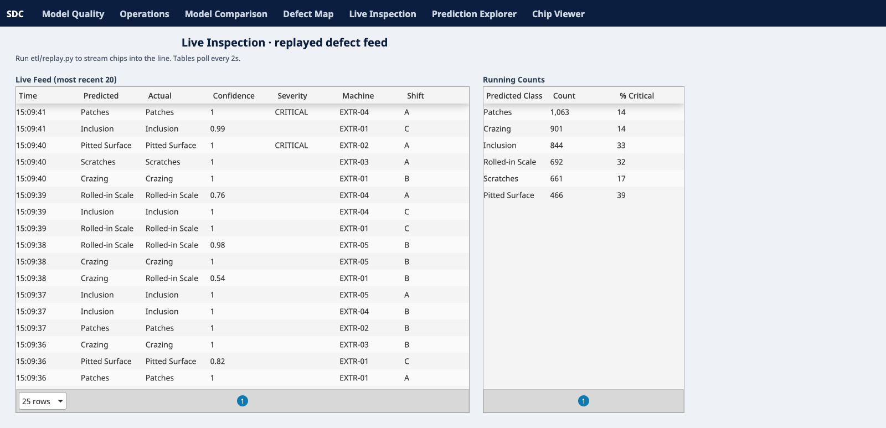
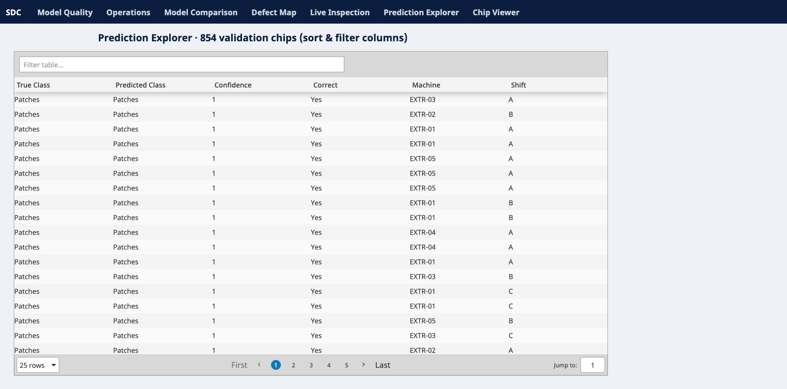
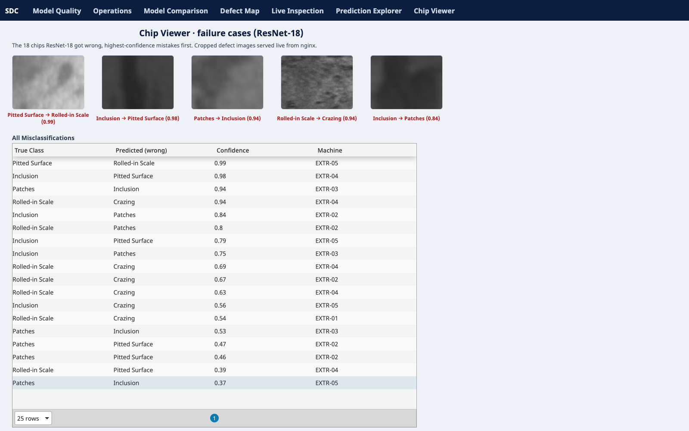

# Surface Defect Classifier

Computer-vision pipeline for chip-level classification of steel surface defects from the
**NEU-DET** benchmark, paired with an **interactive Ignition Perspective dashboard** driven by
**MySQL**. The workflow parses Pascal VOC annotations, crops defect regions, fine-tunes image
classifiers (**ResNet-18** and **ViT-B/16**), exports structured evaluation artifacts, loads them
into a MySQL star schema, and serves a live seven-view inspection dashboard.

---

## The Dashboard

A seven-view, multi-page Perspective application, **live from MySQL** — model quality, plant
operations, model comparison, defect localization, a replayed real-time feed, a filterable
prediction explorer, and the actual misclassified chip images.

### Model Quality
Accuracy / F1 KPI tiles and per-class precision/recall/F1, straight from the database.



### Operations
Per-machine defect counts and cost, a predicted-class **Pareto bar chart**, and defect volume by
day — the MES-style view a line supervisor would watch.



### Model Comparison
ResNet-18 vs ViT-B/16 as **grouped horizontal bars** per class — the ViT shortfall (Pitted Surface
0.57 vs 0.97) is instantly readable — over the live overall-metrics table.



### Defect Map
A **10×10 density heatmap** of where defects land on the strip — each defect's bounding-box center
binned by web (across) × roll (along). The center carries the load; the edges stay clean.



### Live Inspection
A replayed real-time defect feed (polls every 2s) with running per-class counts and critical-rate.



### Prediction Explorer
All 854 validation predictions, sortable and filterable.



### Chip Viewer
The actual chips ResNet-18 got wrong, highest-confidence mistakes first — the failure cases you'd
take to a model review.



> **Want to run it yourself?** The dashboard ships as importable Ignition artifacts (project `.zip`,
> a full gateway `.gwbk`, and a MySQL dump) under [`ignition_dashboard/exports/`](ignition_dashboard/exports/).
> Step-by-step import instructions: **[`ignition_dashboard/IMPORT.md`](ignition_dashboard/IMPORT.md)**.

---

## Models & Results

Both models were fine-tuned on ~3,300 train chips and evaluated on **854** validation chips.

| Metric | ResNet-18 | ViT-B/16 |
| --- | ---: | ---: |
| Accuracy | **0.9789** | 0.7658 |
| Macro F1 | **0.9785** | 0.7431 |
| Weighted F1 | **0.9789** | 0.7647 |

ResNet-18 wins decisively. ViT-B/16 is data-hungry and underfits a dataset this small — a
legitimate, reportable finding rather than a failure.

ResNet-18 per-class:

| Class | Precision | Recall | F1 | Support |
| --- | ---: | ---: | ---: | ---: |
| Crazing | 0.964 | 1.000 | 0.982 | 162 |
| Inclusion | 0.981 | 0.969 | 0.975 | 159 |
| Patches | 0.984 | 0.974 | 0.979 | 193 |
| Pitted Surface | 0.945 | 0.989 | 0.966 | 87 |
| Rolled-in Scale | 0.992 | 0.947 | 0.969 | 132 |
| Scratches | 1.000 | 1.000 | 1.000 | 121 |

The residual weakness is a small **pitted-surface ↔ rolled-in-scale** confusion (texturally
similar) — visible as the top mistake in the Chip Viewer above (`Pitted Surface → Rolled-in Scale`,
confidence 0.99).

---

## Architecture

```text
 NEU-DET images + VOC XML
            |
            v
        train.py  --model {resnet18, vit_b_16}
            |
   chip extraction + fine-tuning
            |
            v
   results/<model>/  (predictions, confusion, class report)
            |
            v
   ignition_dashboard/etl/load_mysql.py  ──►  MySQL star schema
            |                                  (+ synthetic ops: machine/operator/shift/cost/position)
            v
   Ignition Perspective  ◄── named queries ──  MySQL
   (7 live views)
            ^
            └── cropped chip PNGs served statically to the Chip Viewer
```

The repo ships the dashboard as **exported artifacts**, not a running service — see
[`ignition_dashboard/`](ignition_dashboard/):

```
ignition_dashboard/
  exports/                 # importable deliverables
    surface_defect_project.zip      # Perspective project (views + named queries)
    surface_defect_gateway.gwbk     # full gateway backup (project + DB connection)
    surfaceDefect.sql               # mysqldump: schema + data
  ignition/projects/...    # version-controlled project source
  mysql/01_schema.sql      # star schema
  etl/                     # load_mysql.py · enrich.py · replay.py
  IMPORT.md                # how to stand it up on your own gateway
```

---

## Training (reproducibility)

```bash
python -m venv .venv && source .venv/bin/activate
pip install -r requirements.txt

python train.py --model resnet18 --rebuild-chips   # build chips + train ResNet-18
python train.py --model vit_b_16                    # train ViT-B/16 (reuses chips)
```

`train.py` auto-selects the device (`cuda → mps → cpu`). Outputs land in `results/<model>/`
(per-model) and `results/chips/` + `results/*_chips_index.csv` (shared).

The six NEU-DET classes: Crazing, Inclusion, Patches, Pitted Surface, Rolled-in Scale, Scratches.

---

## Limitations

- ViT-B/16 underperforms on this small dataset; a larger corpus would change the comparison.
- The factory-operations layer (machine, operator, shift, cost, timeline, strip position) in the
  dashboard is **synthetic** — deterministically generated to demonstrate an MES-style inspection
  view, not real plant data.
- The benchmark may not represent plant-specific lighting, coating, or imaging conditions.
- Localization is treated as preprocessing, not a jointly learned detection task.
